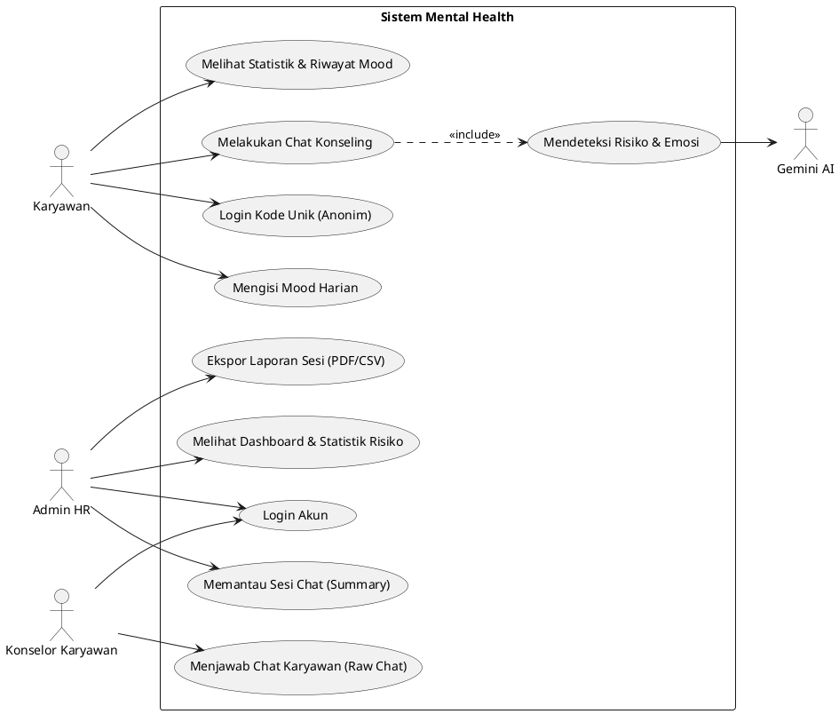
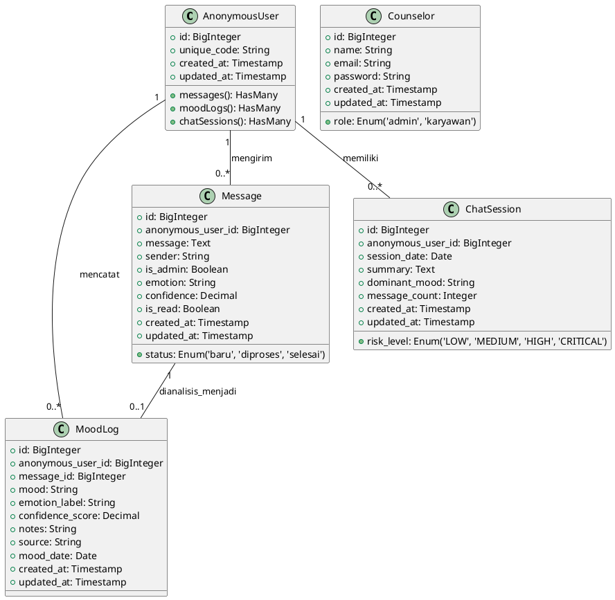
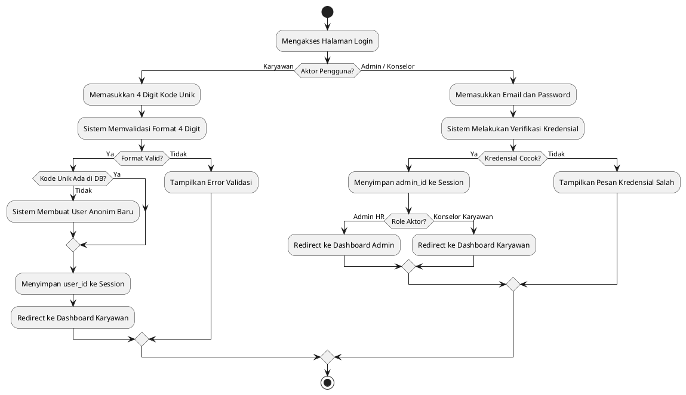
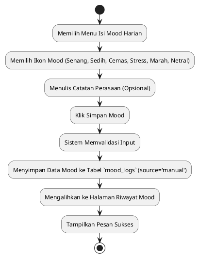
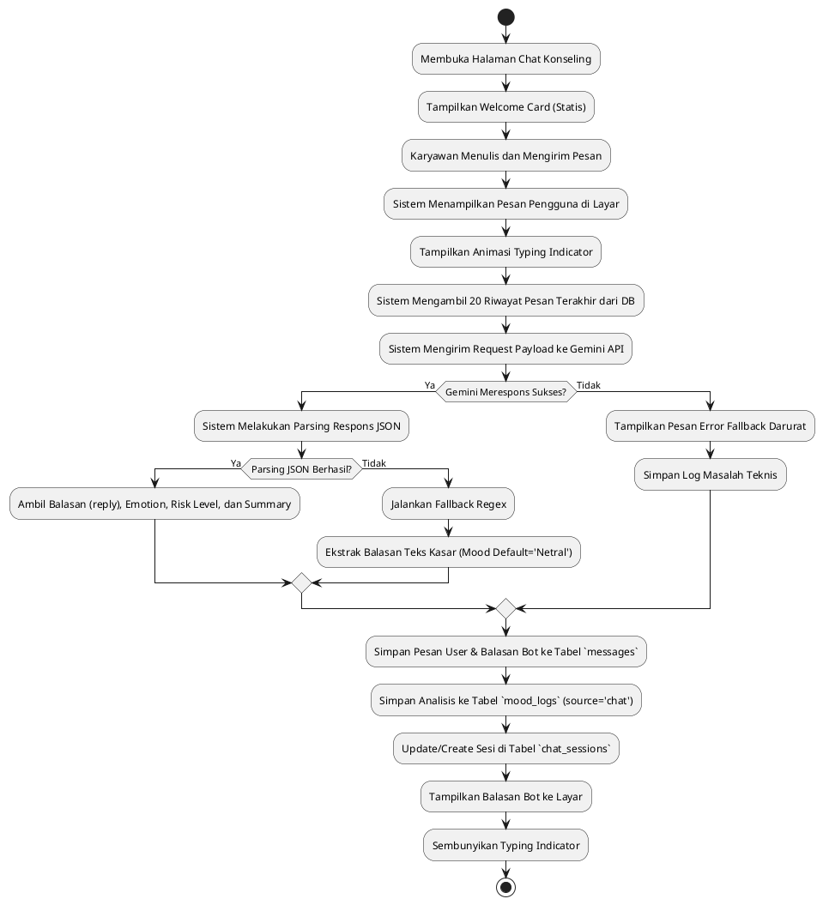
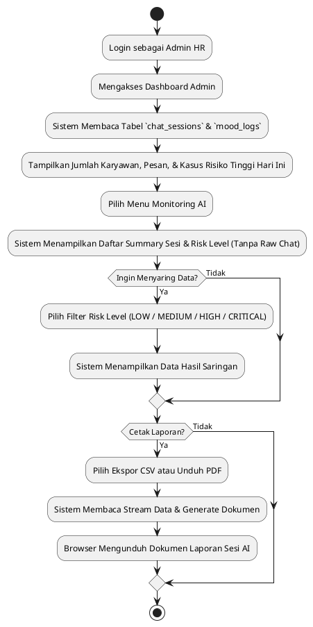
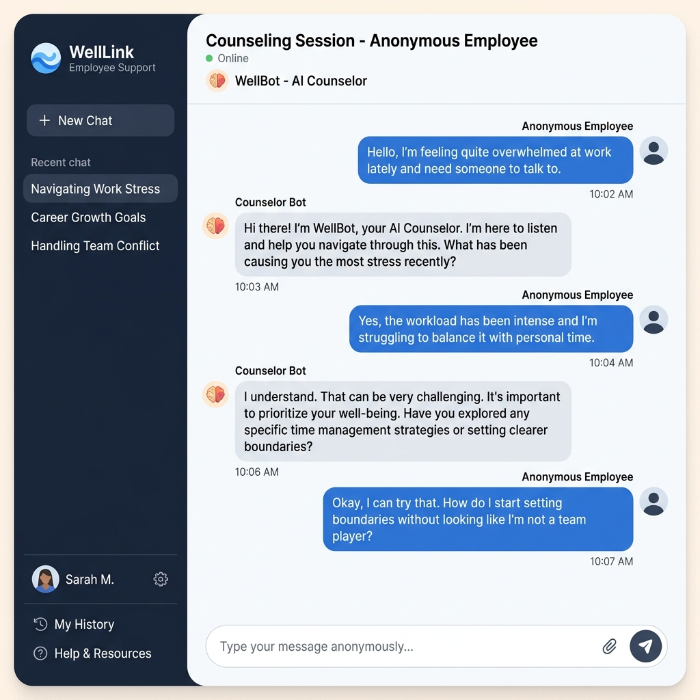
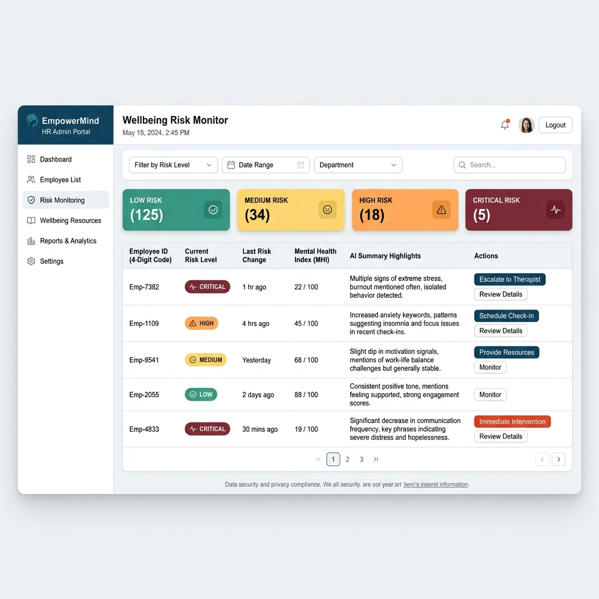

# BAB IV
# HASIL DAN PEMBAHASAN

## 4.1 Analisis Kebutuhan

Analisis kebutuhan dilakukan untuk memetakan seluruh aspek kebutuhan sistem pendukung keputusan kesehatan mental karyawan berbasis kecerdasan buatan (*Artificial Intelligence*). Kebutuhan dibagi menjadi kebutuhan fungsional, kebutuhan non-fungsional, kebutuhan pengguna, serta batasan teknis yang membatasi pengembangan sistem ini.

### 4.1.1 Kebutuhan Fungsional

Kebutuhan fungsional mendefinisikan layanan atau fitur spesifik yang harus disediakan oleh aplikasi *Mental Health*. Berdasarkan analisis kode sumber, kebutuhan fungsional sistem ini dirangkum dalam Tabel 4.1.

**Tabel 4.1 Kebutuhan Fungsional Sistem**

| Kode | Kebutuhan Fungsional | Deskripsi |
| :--- | :--- | :--- |
| **FR-01** | Autentikasi Pengguna | Sistem harus menyediakan fitur login bagi karyawan menggunakan 4 digit kode unik (tanpa nama asli) dan login bagi staf admin/konselor menggunakan *username/email* dan *password*. |
| **FR-02** | Dashboard Karyawan | Karyawan dapat melihat rangkuman statistik mood harian, mingguan, bulanan, serta grafik tren mood dalam 7 hari terakhir. |
| **FR-03** | Dashboard Admin / Konselor | Admin dapat memantau jumlah karyawan terdaftar, jumlah chat masuk, grafik distribusi mood, dan daftar sesi konseling dengan level risiko tertinggi hari ini secara *real-time*. |
| **FR-04** | Chat Konseling AI | Karyawan dapat melakukan obrolan konseling privat secara interaktif dengan asisten AI Gemini yang bertindak sebagai teman curhat netral dan empatik. |
| **FR-05** | Pengisian Mood Harian | Karyawan dapat menginput suasana hati (*mood*) harian beserta catatan opsional untuk memantau kondisi emosional mereka. |
| **FR-06** | Riwayat Mood Karyawan | Karyawan dapat melihat daftar historis suasana hati yang pernah mereka masukkan untuk refleksi diri. |
| **FR-07** | Monitoring Risiko AI (Admin) | Admin HR dapat memantau daftar sesi konseling karyawan berdasarkan level risiko (*risk level*) yang dideteksi oleh AI, tanpa bisa membaca isi pesan mentah. |
| **FR-08** | Monitoring Sesi Chat (Konselor) | Staf Konselor Karyawan (bukan Admin HR) dapat berinteraksi langsung dan menjawab obrolan karyawan yang membutuhkan penanganan lebih lanjut. |
| **FR-09** | Ekspor Laporan | Admin HR dapat mengekspor laporan rangkuman sesi konseling AI dan level risiko karyawan ke format CSV atau PDF untuk keperluan tindak lanjut. |
| **FR-10** | Reset Sistem (*Setup*) | Sistem menyediakan *route* khusus bagi pengembang untuk membersihkan dan me-generate data simulasi awal. |

### 4.1.2 Kebutuhan Non-Fungsional

Kebutuhan non-fungsional menjelaskan batasan operasional dan kriteria kualitas sistem. Kebutuhan non-fungsional aplikasi dirangkum dalam Tabel 4.2.

**Tabel 4.2 Kebutuhan Non-Fungsional**

| Kode | Kebutuhan Non-Fungsional | Deskripsi |
| :--- | :--- | :--- |
| **NFR-01** | Keamanan & Privasi Data | Sistem wajib melindungi kerahasiaan karyawan dengan enkripsi sesi, pembatasan akses pesan mentah bagi Admin HR (blind admin), dan penggunaan ID anonim. |
| **NFR-02** | Performa & Kecepatan Respons | Waktu respons pemrosesan chat oleh Gemini API tidak boleh melebihi 45 detik (*timeout threshold*) dengan indikator mengetik (*typing indicator*) di sisi antarmuka. |
| **NFR-03** | Ketersediaan Sistem (*Availability*) | Sistem harus dapat diakses 24/7. Jika integrasi API mengalami gangguan, sistem harus menyediakan respons *offline* darurat tanpa menghentikan aplikasi. |
| **NFR-04** | Integrasi API Gemini | Sistem wajib terhubung secara aman dengan Google Gemini API menggunakan kunci API (*API Key*) yang dikonfigurasi melalui file environment `.env`. |
| **NFR-05** | Responsivitas Tampilan | Antarmuka pengguna harus menggunakan desain responsif (CSS modern dengan Bootstrap) sehingga nyaman diakses melalui perangkat seluler maupun desktop. |

### 4.1.3 Kebutuhan Pengguna

Sistem ini mendefinisikan tiga aktor pengguna utama yang memiliki kebutuhan akses berbeda:
1. **Karyawan (Client)**: Membutuhkan ruang aman anonim untuk mencurahkan keluh kesah, mendapatkan respons instan dari AI, menginput suasana hati, serta memantau grafik kestabilan emosi mereka.
2. **Konselor Karyawan (Staf Staf Medis/Konselor)**: Membutuhkan akses penuh terhadap riwayat pesan obrolan karyawan secara *real-time* untuk memberikan intervensi manusia secara langsung saat status chat ditandai sebagai `baru` atau `diproses`.
3. **Admin HR (Manajemen Perusahaan)**: Membutuhkan visualisasi tingkat risiko emosional karyawan secara agregat (*summary* dan *risk level*), mengunduh dokumen laporan, tanpa memiliki hak akses untuk membaca pesan obrolan privat demi menjaga kepercayaan karyawan.

### 4.1.4 Batasan Teknis

Batasan teknis sistem ini meliputi:
- Sistem dikembangkan menggunakan kerangka kerja **Laravel 12.6.2** dan bahasa pemrograman **PHP 8.3.30**.
- Database yang digunakan adalah **MySQL 8.0** dengan relasi integritas data berbasis kunci tamu (*foreign key*).
- Ketergantungan penuh terhadap koneksi internet untuk melakukan pemanggilan HTTPS POST ke endpoint **Google Gemini API** (`https://generativelanguage.googleapis.com`).
- Pembatasan pemanggilan API (*Rate Limit*) sebesar 20 kali kirim pesan per menit per karyawan demi menghindari eksploitasi kuota API Key.

---

## 4.2 PERANCANGAN SISTEM

### 4.2.1 Arsitektur Sistem

Sistem ini mengadopsi arsitektur *Client-Server* berbasis Model-View-Controller (MVC) Laravel. Interaksi sistem digambarkan dalam bagan alir data berikut:

```
+---------------+        HTTP Request       +--------------------+
|               | ------------------------> |                    |
|    Browser    |                           |  Laravel Backend   |
|   (Karyawan/  | <------------------------ | (Controller/Route) |
|    Counselor) |        HTML / JSON        +--------------------+
+---------------+                                     |
                                        +-------------+-------------+
                                        |                           |
                                        v                           v
                             +--------------------+       +--------------------+
                             |      Database      |       |     Gemini API     |
                             |      (MySQL)       |       | (Analisis & Chat)  |
                             +--------------------+       +--------------------+
```
**Gambar 4.1 Diagram Arsitektur Alir Data Sistem**

Narasi Gambar 4.1: Ketika browser mengirimkan permintaan (seperti mengirim chat), Laravel Router akan meneruskannya ke Controller terkait. Controller akan melakukan kueri ke MySQL untuk menyimpan/mengambil data, dan secara asinkron melakukan panggilan REST API ke server Google Gemini untuk mendapat respons AI beserta analisis sentimen. Hasil akhir kemudian dikompilasi kembali ke browser dalam bentuk visualisasi antarmuka.

### 4.2.2 Use Case Diagram

Perancangan fungsionalitas sistem digambarkan melalui Use Case Diagram pada Gambar 4.2, memisahkan hak akses antara Karyawan, Admin HR, Konselor Karyawan, dan sistem eksternal Gemini AI.


*Kode di atas merupakan sintaks PlantUML untuk Use Case Diagram.*

### 4.2.3 Class Diagram

Struktur basis data dan relasi model Eloquent dalam Laravel digambarkan pada Class Diagram di Gambar 4.3.


*Kode di atas merupakan sintaks PlantUML untuk Class Diagram.*

### 4.2.4 Activity Diagram

#### 1. Activity Diagram: Login Karyawan dan Admin


#### 2. Activity Diagram: Pengisian Mood Harian


#### 3. Activity Diagram: Chat Konseling AI


#### 4. Activity Diagram: Monitoring Admin HR


### 4.2.5 Tampilan Antarmuka

#### 1. Halaman Dashboard Karyawan
- **Fungsi**: Pusat informasi perkembangan kondisi psikologis bagi karyawan.
- **Komponen Utama**: Widget Mood Hari Ini, Rangkuman Tren Mood Mingguan & Bulanan, Chart Line grafik fluktuasi mood 7 hari terakhir, dan menu akses cepat.

#### 2. Halaman Chat Konseling AI
- **Fungsi**: Antarmuka interaksi dua arah antara karyawan dengan kecerdasan buatan.
- **Komponen Utama**: *Welcome Card* informatif, Balon Percakapan (*Chat Bubbles*), Animasi Mengetik (*Typing Indicator*), Input Kolom Obrolan, dan tombol kirim.
- **Gambar Antarmuka**: Lihat Gambar 4.4.


*Gambar 4.4 Tampilan Halaman Chat Konseling AI Karyawan*

Narasi Gambar 4.4: Halaman ini memfasilitasi karyawan melakukan konsultasi secara dua arah dengan AI. Tampilan chat beradaptasi dengan status mengetik secara dinamis untuk memberikan interaksi interaktif layaknya bercakap-cakap dengan manusia.

#### 3. Halaman Dashboard Admin
- **Fungsi**: Ruang monitoring terpusat bagi pihak HR/Admin Perusahaan untuk memantau kesehatan mental karyawan secara agregat.
- **Komponen Utama**: Kartu Statistik (Total Karyawan, Total Pesan, Mood Hari Ini), Indikator Kasus Kritis (Peringatan Risiko Tinggi), dan daftar aktivitas sesiAI terbaru.
- **Gambar Antarmuka**: Lihat Gambar 4.5.


*Gambar 4.5 Tampilan Halaman Dashboard Admin HR*

Narasi Gambar 4.5: Halaman monitoring admin HR menyajikan informasi risiko mental karyawan tanpa memperlihatkan identitas asli karyawan maupun isi pesan percakapan mereka untuk memastikan standar privasi terjaga tinggi.

---

## 4.3 IMPLEMENTASI

Bagian ini membahas implementasi kode program (*source code*) pada sistem Mental Health sesuai dengan perancangan yang telah didefinisikan sebelumnya.

### 4.3.1 Implementasi Login Karyawan (Anonim)

Karyawan dapat masuk ke sistem dengan mengetikkan 4 digit kode unik bebas. Implementasi validasi dan penyimpanan sesi ini diatur di dalam `AuthController.php`.

```php
// File: app/Http/Controllers/AuthController.php
public function employeeLogin(Request $request)
{
    $request->validate([
        'unique_code' => 'required|digits:4',
    ], [
        'unique_code.required' => 'Kode unik wajib diisi',
        'unique_code.digits' => 'Kode unik harus berupa 4 angka',
    ]);

    // Ambil user berdasarkan kode unik, jika belum ada buat baru
    $user = AnonymousUser::where('unique_code', $request->unique_code)->first();

    if (!$user) {
        $user = AnonymousUser::create([
            'unique_code' => $request->unique_code,
        ]);
    }

    // Simpan session user_id
    Session::put('user_id', $user->id);

    return redirect('/employee/dashboard');
}
```

**Alur Proses**: Saat form login dikirimkan, sistem memvalidasi bahwa input harus berisi tepat 4 karakter numerik. Selanjutnya, sistem mencari kecocokan data pada tabel `anonymous_users`. Jika tidak ditemukan, entri data baru akan dibuat secara dinamis. Sesi browser kemudian mencatat ID pengguna sebelum dialihkan ke dashboard.

### 4.3.2 Implementasi Role Middleware

Pembagian hak akses antara Admin HR, Konselor, dan Karyawan diatur secara ketat menggunakan middleware khusus bernama `RoleMiddleware.php`.

```php
// File: app/Http/Middleware/RoleMiddleware.php
class RoleMiddleware
{
    public function handle(Request $request, Closure $next, $role)
    {
        if (in_array($role, ['admin', 'karyawan'])) {
            if (!Session::has('admin_id')) {
                return redirect('/login');
            }

            $user = Counselor::find(Session::get('admin_id'));
            
            if (!$user) {
                Session::forget('admin_id');
                return redirect('/login')->with('error', 'Sesi telah berakhir karena reset sistem.');
            }

            if ($user->role !== $role) {
                if ($user->role == 'admin') {
                    return redirect('/admin/dashboard');
                } else if ($user->role == 'karyawan') {
                    return redirect('/karyawan/dashboard');
                }
                return abort(403, 'Anda tidak memiliki akses ke halaman ini.');
            }
        }
        
        if ($role === 'client') {
            if (!Session::has('user_id')) {
                return redirect('/employee');
            }

            $client = \App\Models\AnonymousUser::find(Session::get('user_id'));
            if (!$client) {
                Session::forget('user_id');
                return redirect('/employee')->with('error', 'Sesi telah berakhir karena reset sistem.');
            }
        }

        return $next($request);
    }
}
```

**Alur Proses**: Middleware menyaring setiap permintaan rute berdasarkan parameter role yang dikirimkan. Jika sesi tidak sesuai dengan kriteria (misalnya, akun karyawan mencoba mengakses rute admin), sistem akan langsung melempar respons halaman diblokir (*Error 403*) atau mengarahkannya kembali ke halaman login. Jika *database* baru saja di-reset, sistem akan otomatis membersihkan sesi usang agar pengguna tidak mengalami kendala halaman eror.

### 4.3.3 Implementasi Mood Tracking (Manual)

Fitur pencatatan suasana hati secara mandiri oleh karyawan diimplementasikan pada `EmployeeController.php`.

```php
// File: app/Http/Controllers/EmployeeController.php
public function saveMood(Request $request)
{
    $request->validate([
        'mood' => 'required|string|max:255',
        'notes' => 'nullable|string'
    ]);

    MoodLog::create([
        'anonymous_user_id' => session('user_id'),
        'mood' => $request->mood,
        'notes' => $request->notes,
        'source' => 'manual', // Ditandai dari input manual
        'mood_date' => now()->toDateString()
    ]);

    return redirect('/employee/riwayat-mood')->with('success', 'Mood berhasil disimpan!');
}
```

**Alur Proses**: Nilai mood yang dipilih pengguna beserta catatan singkat opsional divalidasi keamanannya sebelum disimpan ke dalam tabel `mood_logs`. Sistem mencatat waktu serta menandai kolom `source` bernilai `'manual'` untuk membedakannya dengan data mood yang terdeteksi otomatis melalui analisis AI di dalam ruang obrolan.

### 4.3.4 Implementasi Integrasi Gemini API & Context Memory

Proses komunikasi backend dengan Google Gemini API dan pengiriman riwayat obrolan diatur di dalam `ChatController.php`.

```php
// File: app/Http/Controllers/ChatController.php
// Mengambil 20 riwayat pesan terakhir untuk context memory
$history = Message::where('anonymous_user_id', $userId)
    ->orderByDesc('id')
    ->limit(20)
    ->get()
    ->reverse()
    ->map(function ($msg) {
        return [
            'role' => $msg->sender === 'employee' ? 'user' : 'model',
            'parts' => [['text' => $this->getReplyText($msg->message)]]
        ];
    })
    ->values()
    ->toArray();

$contents = $history;
$contents[] = [
    'role' => 'user',
    'parts' => [['text' => $request->string('message')->trim()->toString()]]
];

$payload = [
    'systemInstruction' => [
        'parts' => [['text' => $systemPrompt]]
    ],
    'contents' => $contents,
    'generationConfig' => [
        'temperature' => 0.7,
        'topP' => 0.9,
        'maxOutputTokens' => 1000,
        'responseMimeType' => 'application/json',
        'responseSchema' => [
            'type' => 'OBJECT',
            'properties' => [
                'reply' => ['type' => 'STRING'],
                'emotion' => ['type' => 'STRING', 'enum' => ['Sedih', 'Marah', 'Cemas', 'Stress', 'Bahagia', 'Netral']],
                'confidence' => ['type' => 'INTEGER'],
                'risk_level' => ['type' => 'STRING', 'enum' => ['LOW', 'MEDIUM', 'HIGH', 'CRITICAL']],
                'summary' => ['type' => 'STRING']
            ],
            'required' => ['reply', 'emotion', 'confidence', 'risk_level', 'summary'],
        ],
    ],
];
```

**Alur Proses**: Program menarik hingga 20 obrolan terdahulu karyawan dan menyusunnya dalam struktur pasangan *User* dan *Model*. Seluruh data payload (termasuk *System Instruction* dan skema JSON balasan yang diharapkan) dibungkus lalu dikirimkan melalui protokol HTTP POST ke server Google Gemini.

### 4.3.5 Implementasi JSON Fallback Toleran (Anti-Error)

Untuk mengantisipasi Gemini mengembalikan respons teks biasa atau data JSON terpotong di tengah kalimat, diimplementasikan logika penanganan pengecualian tangguh berikut.

```php
// File: app/Http/Controllers/ChatController.php
$data = json_decode($text, true);

// JSON Fallback jika parsing JSON gagal atau terpotong
if (json_last_error() !== JSON_ERROR_NONE || !isset($data['reply'])) {
    // Regex fallback jika JSON terpotong (tidak butuh closing quote wajib)
    if (preg_match('/"reply"\s*:\s*"((?:[^"\\\\]|\\\\.)*)/s', $text, $matches)) {
        $rawString = $matches[1];
        $decoded = json_decode('"' . $rawString . '"');
        $botReply = $decoded ?: stripslashes($rawString);
    } else {
        $botReply = $text; // Fallback ekstrim mengambil seluruh teks mentah
    }
    $emotion = 'Netral';
    $confidence = 0;
    $riskLevel = 'LOW';
    $summary = '';
} else {
    $botReply = $data['reply'];
    $emotion = $data['emotion'] ?? 'Netral';
    $confidence = $data['confidence'] ?? 0;
    $riskLevel = $data['risk_level'] ?? 'LOW';
    $summary = $data['summary'] ?? '';
}
```

**Alur Proses**: Jika fungsi `json_decode` bawaan PHP menghasilkan nilai salah (*false*), modul regex darurat akan diaktifkan untuk menangkap teks di dalam parameter `"reply"`. Hal ini mencegah chat memunculkan tulisan eror teknis di layar pengguna secara aman.

---

## 4.4 PENGUJIAN

### 4.4.1 Metode Pengujian

Metode pengujian yang digunakan dalam penelitian ini adalah **Black Box Testing** (Pengujian Kotak Hitam). Metode ini berfokus pada pengujian fungsionalitas sistem tanpa harus mengetahui struktur internal kode program. Pengujian dilakukan dengan cara memberikan masukan (*input*) tertentu ke sistem dan memeriksa apakah luaran (*output*) yang dihasilkan telah sesuai dengan skenario hasil yang diharapkan.

### 4.4.2 Hasil Pengujian

Pengujian dilakukan terhadap seluruh fitur utama pada aplikasi pendamping kesehatan mental. Hasil pengujian dirangkum dalam Tabel 4.3.

**Tabel 4.3 Hasil Pengujian Fungsionalitas Sistem**

| Fitur / Modul | Skenario Pengujian | Hasil yang Diharapkan | Hasil Aktual | Status |
| :--- | :--- | :--- | :--- | :--- |
| **Login Karyawan** | Memasukkan kode unik 4 angka (misal: `1234`). | Masuk ke Dashboard Karyawan, membuat data anonim baru jika belum terdaftar. | Pengguna dialihkan ke dashboard karyawan dan data user baru tercatat di DB. | **Berhasil** |
| **Isi Mood Harian** | Mengisi form mood 'Cemas' dengan catatan 'Cemas presentasi besok'. | Data tersimpan di tabel `mood_logs` dengan tanda `source` bernilai `'manual'`. | Data mood tersimpan dengan atribut tanggal hari ini secara sukses. | **Berhasil** |
| **Chat Gemini AI** | Mengirimkan pesan keluhan ke asisten konseling AI. | AI membalas dengan respons empatik. Data tersimpan di DB secara otomatis. | Gemini merespons pesan secara real-time dan menyimpan log obrolan di DB. | **Berhasil** |
| **Context Memory** | Melakukan chat bersambung: "Halo" -> "Capek kerja" -> "Atasan marah". | AI mengingat konteks keluhan atasan di pesan berikutnya tanpa bertanya ulang. | AI merespons sesuai alur dengan ingatan 20 riwayat percakapan terakhir. | **Berhasil** |
| **Fallback JSON** | Menguji jika AI gagal merespons dengan JSON valid. | Chat tetap berjalan lancar dengan mengambil balasan mentah (tidak error). | Balasan AI tetap tampil di layar obrolan tanpa menampilkan kode mentah. | **Berhasil** |
| **Dashboard Admin** | Mengakses statistik ringkasan data kesehatan mental. | Admin melihat jumlah kasus risiko hari ini secara ringkas & anonim. | Visualisasi data grafik dan indikator level risiko tampil dengan akurat. | **Berhasil** |
| **Monitoring HR** | Admin memantau data sesi curhat karyawan di halaman khusus. | Tampil rangkuman AI (*summary*) dan tingkat risiko tanpa isi pesan mentah. | Sesi obrolan tersaji secara privat, tidak menampilkan pesan mentah karyawan. | **Berhasil** |
| **Laporan Ekspor** | Admin mengunduh berkas laporan sesi AI (CSV & PDF). | Dokumen terunduh dengan informasi terstruktur dan rapi. | File CSV dan PDF terunduh dengan data ringkasan sesi yang valid. | **Berhasil** |

### 4.4.3 Kesimpulan Pengujian

Berdasarkan hasil pengujian *Black Box Testing* yang telah dilakukan, dapat ditarik beberapa kesimpulan penting sebagai berikut:
1. Seluruh fungsi utama aplikasi (autentikasi anonim, pencatatan mood, ruang obrolan kecerdasan buatan, dan dashboard pelaporan) telah berjalan dengan baik sesuai skenario yang direncanakan.
2. Keamanan hak akses pengguna (*Role Management*) terbukti aman dengan tidak adanya kebocoran akses pesan rahasia karyawan ke pihak manajemen HR (Admin HR).
3. Integrasi Gemini API telah berjalan secara dinamis menggunakan database *context memory* 20 pesan dengan sistem pengaman fallback yang terbukti tangguh terhadap kesalahan kegagalan format JSON.
4. Tidak ditemukan kesalahan fatal (*critical crash*) pada sistem selama proses pengujian dilakukan. Sistem siap digunakan untuk mendukung keputusan kesehatan emosional di lingkungan kerja.
